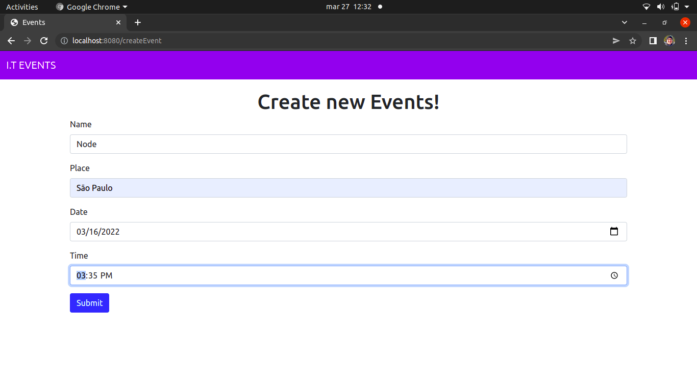
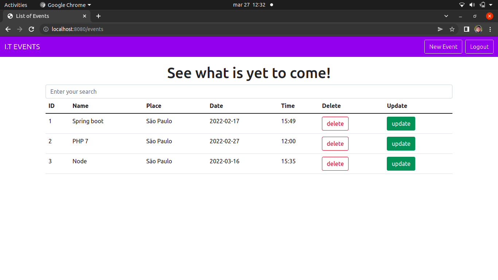

# Events App using Spring Boot
>This consists of an App where the person can create, consult, delete and update events of technologies. 

# Technologies and dependencies
 - Java 11
 - Spring Boot 2.6.1
 - Spring Boot Starter Data JPA
 - Thymeleaf
 - Bootstrap
 - Spring Boot Web Starter
 - Mysql 
 
# images

 
